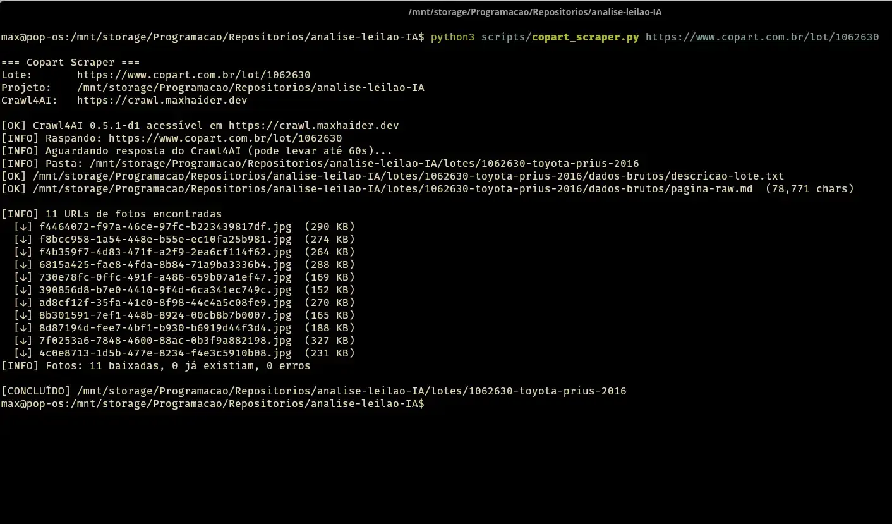
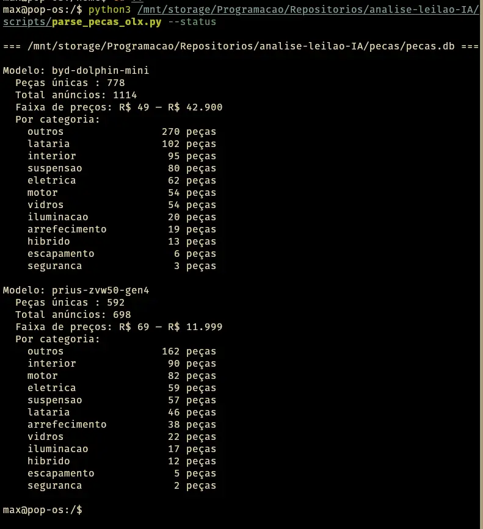

# Vehicle Auction AI

> 🇺🇸 [English version](README.en.md) &nbsp;|&nbsp; [github.com/maxh33/vehicle-auction-ai](https://github.com/maxh33/vehicle-auction-ai)

Framework de análise de lotes em leilões de veículos com apoio de IA (Claude/Gemini).

Foco em veículos danificados e recuperados de sinistro no mercado brasileiro, com avaliação técnica completa por fotos, análise de custo-benefício e suporte a decisão de lance.

---

## Como funciona

**Leilões Copart — coleta automatizada:**

```
URL do lote (copart.com.br)
    ↓
copart_scraper.py — cria pasta, extrai dados e baixa fotos HD automaticamente
    ↓
Análise com IA (Claude ou Gemini) — fotos + dados brutos + prompt
    ↓
Relatórios gerados (analise-tecnica.md + analise-custo.md)
    ↓
Decisão: lance máximo, condicionantes, ou descartar lote
```

**Outros leilões (Sodré Santoro, etc.) — coleta manual** *(automação planejada)*:

```
Leilão online
    ↓
Coleta manual de dados brutos (descrição do lote, condições de venda)
    ↓
Fotos do veículo (baixadas do site ou tiradas na vistoria)
    ↓
Template de prompt preenchido (templates/prompt-avaliacao-leilao.md)
    ↓
Análise com IA (Claude ou Gemini) — fotos + dados brutos + prompt
    ↓
Relatórios gerados (analise-tecnica.md + analise-custo.md)
    ↓
Decisão: lance máximo, condicionantes, ou descartar lote
```

> **Roadmap:** scrapers para Sodré Santoro, Leilão Meu, Pátio Digital e outras
> leiloeiras brasileiras estão planejados. Contribuições são bem-vindas —
> veja a seção [Contribuindo](#contribuindo).

---

## Estrutura do Projeto

```
vehicle-auction-ai/
│
├── README.md                          # Este arquivo
│
├── scripts/
│   ├── copart_scraper.py              # Coleta automática de lotes Copart
│   └── parse_pecas_olx.py             # Parser de dumps OLX → SQLite + markdown
│
├── pecas/                             # Banco de preços de peças por modelo
│   ├── pecas.db                       # SQLite — todos os modelos num único arquivo
│   ├── prius-zvw50-gen4/
│   │   ├── cesta-colisao.md           # Exportação para análise IA
│   │   ├── cesta-enchente.md          # Exportação para análise IA
│   │   └── raw/                       # Dumps originais preservados
│   └── byd-dolphin-mini/
│       └── raw/
│
├── templates/                         # Prompts reutilizáveis (agnósticos de veículo)
│   └── prompt-avaliacao-leilao.md     # Master prompt para análise de qualquer lote
│
├── guias/                             # Documentação técnica por modelo/tipo de veículo
│   └── prius-zvw50-gen4/
│       └── guia-precompra-prius-zvw50.md  # Checklist e diagnósticos para Prius Gen 4
│
├── lotes/                             # Um subdiretório por lote analisado
│   └── 0215-toyota-prius-nga-2017/   # Formato: {número}-{marca}-{modelo}-{ano}
│       ├── analise-tecnica.md         # Avaliação foto-a-foto, danos, riscos, parecer
│       ├── analise-custo.md           # Custos totais, cenários, decisão final
│       ├── dados-brutos/
│       │   ├── descricao-lote.txt     # Dados do lote extraídos do site da leiloeira
│       │   ├── pagina-raw.md          # Markdown completo da página (lotes Copart)
│       │   └── condicoes-venda.txt    # Regulamento completo da leiloeira
│       └── fotos/
│           └── *.jpg / *.webp         # Fotos originais do lote (nomes preservados)
│
└── .claude/
    └── settings.local.json            # Permissões do Claude Code para este projeto
```

### Convenção de nomenclatura

| Elemento | Formato | Exemplo |
|----------|---------|---------|
| Pasta do lote | `{número}-{marca}-{modelo}-{ano}` | `0215-toyota-prius-nga-2017` |
| Análise técnica | `analise-tecnica.md` | mesmo nome em todo lote |
| Análise de custo | `analise-custo.md` | mesmo nome em todo lote |
| Guias especializados | `guia-{modelo}.md` dentro de `guias/{modelo}/` | `guias/prius-zvw50-gen4/` |

---

## Como analisar um novo lote

### Lotes Copart — automatizado

Execute o scraper com a URL do lote:

```bash
cd /path/to/vehicle-auction-ai
source ~/.secrets
python3 scripts/copart_scraper.py https://www.copart.com.br/lot/NUMERO_DO_LOTE
```

O script cria automaticamente:

```
lotes/{código}-{marca}-{modelo}-{ano}/
├── dados-brutos/
│   ├── descricao-lote.txt    # Campos estruturados do lote
│   └── pagina-raw.md         # Markdown completo da página
└── fotos/
    └── *.jpg                 # Fotos HD (1600×1200)
```

**Passo manual restante:** se houver Condições Específicas do vendedor, o link estará em `descricao-lote.txt` — baixar o PDF e salvar como `dados-brutos/condicoes-especificas.pdf`.

Em seguida, pular para o **passo 4** abaixo (preencher o template de prompt).

---

### Outros leilões — manual

#### 1. Criar a pasta do lote

```
lotes/{número}-{marca}-{modelo}-{ano}/
├── dados-brutos/
└── fotos/
```

Exemplo:
```bash
mkdir -p lotes/0318-honda-civic-ex-2019/dados-brutos lotes/0318-honda-civic-ex-2019/fotos
```

#### 2. Coletar dados brutos

Salvar em `dados-brutos/`:
- `descricao-lote.txt` — copiar a descrição completa do lote no site da leiloeira
- `condicoes-venda.txt` — baixar o regulamento/condições da leiloeira (se ainda não tiver para aquela casa)

Para preços de peças, usar o banco centralizado em `pecas/` (ver seção **Preços de Peças**).

#### 3. Baixar as fotos

Salvar todas as fotos em `fotos/` com os nomes originais do site (não renomear — preserva rastreabilidade).

---

### 4. Preencher o template de prompt

Abrir `templates/prompt-avaliacao-leilao.md` e preencher as variáveis:
- Dados da leiloeira e do lote
- Localização do comprador e uso pretendido
- Estrutura de custos (comissão, logística, transferência)
- Alertas técnicos específicos do veículo

### 5. Rodar a análise com IA

No Claude Code, abrir uma nova sessão neste projeto e submeter:
- O prompt preenchido como contexto inicial
- As fotos do lote
- Os arquivos de `dados-brutos/` como contexto adicional

### 6. Salvar os relatórios

- Análise foto-a-foto, danos, riscos e parecer → `analise-tecnica.md`
- Custos totais, cenários de uso e decisão de lance → `analise-custo.md`

---

## Coleta Automática — Copart

### Pré-requisitos

```bash
pip install requests
```

Variáveis de ambiente em `~/.secrets`:

| Variável | Descrição |
|----------|-----------|
| `CRAWL4AI_URL` | URL do Crawl4AI (ex: `https://crawl.example.com`) |
| `CRAWL4AI_USER` | Usuário BasicAuth |
| `CRAWL4AI_PASS` | Senha BasicAuth |
| `GEMINI_API_KEY` | Chave Gemini para extração LLM (melhora campos opcionais) |

### Uso

```bash
# Coleta completa (dados + fotos)
python3 scripts/copart_scraper.py https://www.copart.com.br/lot/1083986

# Só dados, sem baixar fotos (mais rápido para monitorar lotes)
python3 scripts/copart_scraper.py https://www.copart.com.br/lot/1083986 --no-photos

# Salvar em diretório diferente do padrão
python3 scripts/copart_scraper.py https://www.copart.com.br/lot/1083986 --dir /outro/caminho
```

### O que o script extrai

Campos estruturados: marca, modelo, versão, ano, condição, tipo de monta, tipo de documento, valor FIPE, pátio, data de venda, condição de funcionamento, notas, termos de responsabilidade.

Fotos: todas em HD (`1600×1200`) com extensão correta detectada automaticamente.



### Limitações

- **Condições Específicas do vendedor** — disponível como PDF em domínio autenticado (`erp.copart.com.br`). O link é salvo em `descricao-lote.txt` para download manual.
- **Lotes "Venda Futura"** — o script coleta os dados disponíveis, mas fotos podem estar ausentes até liberação para leilão.

### Infraestrutura

Crawl4AI v0.8.0 rodando em VPS próprio, exposto via Traefik com HTTPS + BasicAuth. Usa Playwright interno para contornar o WAF Incapsula da Copart. Veja [github.com/unclecode/crawl4ai](https://github.com/unclecode/crawl4ai) para instalar sua própria instância.

---

## Preços de Peças

Banco centralizado de preços de desmanche (OLX e outras fontes), organizado por modelo.

### Estrutura

```
pecas/
├── pecas.db                          # SQLite — todos os modelos num único arquivo
├── prius-zvw50-gen4/
│   ├── cesta-colisao.md              # Exportação para análise IA — colisão
│   ├── cesta-enchente.md             # Exportação para análise IA — enchente
│   └── raw/
│       └── olx-nevada-2026-02.txt    # Dump original OLX (preservado)
└── byd-dolphin-mini/
    └── raw/
        └── olx-2026-02.txt           # Dump original a importar
```

### Importar novo dump

```bash
python3 scripts/parse_pecas_olx.py pecas/{modelo}/raw/{arquivo}.txt \
    --modelo {modelo} \
    --fonte "OLX/Nevada"

# Exemplos:
python3 scripts/parse_pecas_olx.py pecas/prius-zvw50-gen4/raw/olx-nevada-2026-02.txt \
    --modelo prius-zvw50-gen4 --fonte "OLX/Nevada"

python3 scripts/parse_pecas_olx.py pecas/byd-dolphin-mini/raw/olx-2026-02.txt \
    --modelo byd-dolphin-mini --fonte "OLX/geral"
```

### Exportar cesta para análise IA

```bash
# Gera pecas/{modelo}/cesta-colisao.md e cesta-enchente.md
python3 scripts/parse_pecas_olx.py --exportar prius-zvw50-gen4
```

Incluir o arquivo `cesta-{tipo}.md` como contexto na análise de custo:
- Abre o arquivo no Claude Code antes de rodar a análise
- Ou copie o conteúdo no prompt junto com as fotos do lote

### Ver resumo do banco

```bash
python3 scripts/parse_pecas_olx.py --status
```



### Como usar na análise de lotes

Na análise de custo (`analise-custo.md`), referencie os preços do banco:

```
Dados de preços: @pecas/prius-zvw50-gen4/cesta-colisao.md
```

Ou submeta o arquivo diretamente no contexto da sessão Claude.

---

## Guias Especializados

| Veículo | Guia | Conteúdo |
|---------|------|---------|
| Toyota Prius Gen 4 (ZVW50, 2016–2022) | `guias/prius-zvw50-gen4/guia-precompra-prius-zvw50.md` | App Dr. Prius, OBD compatível, checklist bateria HV, problemas conhecidos, recalls |

---

## Lotes Analisados

| Lote | Veículo | Leiloeira | Data | Lance máximo recomendado | Resultado |
|------|---------|-----------|------|--------------------------|-----------|
| 0215 | Toyota Prius NGA TOP 2017, 101.539 km, enchente, Média Monta | Sodré Santoro #28139 | 2026-02-27 | R$ 16.000 | CONDICIONAL — uso pessoal viável; arremate caiu em R$ 36.900 (acima do recomendado) |
| 1062630 | Toyota Prius Hybrid 1.8 2016/2016, colisão, pátio Eusébio/CE | Copart Brazil | Venda Futura | — | MONITORANDO — aguardando liberação para leilão; análise técnica pendente |
| 1083986 | BYD Dolphin Mini 2025, colisão (financiamento), pátio Eusébio/CE | Copart Brazil | 2026-02-28 | — | COLETADO — dados e 10 fotos HD via scraper; análise técnica pendente |

---

## Requisitos e Ferramentas

### Para coleta automática (Copart)

- **Python 3.8+**
- `pip install requests` — única dependência externa
- Acesso ao Crawl4AI via `CRAWL4AI_URL` em `~/.secrets`

### Para diagnóstico presencial (veículos híbridos Toyota)

| Ferramenta | Descrição | Link |
|------------|-----------|------|
| **Dr. Prius** (app) | Diagnóstico da bateria HV por OBD. Versão gratuita lê dados; versão paga faz Battery Health Test (3 usos) | App Store / Play Store |
| **Veepeak OBDCheck BLE+** | Dongle OBD compatível com Dr. Prius no iOS/Android | Amazon |
| **PanLong ELM327 Bluetooth** | Alternativa econômica de dongle OBD | Mercado Livre |

> **Atenção:** O dongle ELM327 Mini Bluetooth padrão (azul) **não é compatível** com Dr. Prius. Use os modelos acima.

### Para pesquisa de preços

- **OLX** — Peças usadas (buscar por desmanche especializado no modelo)
- **Mercado Livre** — Peças novas e usadas, comparar com desmanche
- **Tabela FIPE** — Referência de valor de mercado ([fipe.org.br](https://www.fipe.org.br))

### Para consulta de débitos e restrições

- **DETRAN-PR** — Consulta de débitos e restrições por placa
- **DETRAN-SP** — Idem para veículos emplacados em SP
- **Motorágora** — Histórico de sinistros e laudos

---

## Contexto Legal (Brasil)

- **Média Monta** — Classificação de dano que exige laudo INMETRO antes de circular
- **Transferência interestadual** — Exige placa Mercosul; prazo de entrega de documentos pode ultrapassar 30 dias úteis
- **Comissão do leiloeiro** — Geralmente 5% sobre o valor do arremate (não reembolsável)
- **IPVA e licenciamento** — Verificar se está quitado pelo vendedor antes do lance
- **Multas anteriores ao leilão** — Responsabilidade do comprador (até R$ 500 o seguro pode cobrir)

---

## Contribuindo

Contribuições são bem-vindas! Os componentes principais são genéricos e feitos para crescer com a comunidade.

### O que você pode contribuir

| Área | Exemplos |
|------|---------|
| **Novos scrapers** | Sodré Santoro, Leilão Meu, Pátio Digital, Bidar, Zukerman |
| **Guias de veículos** | Checklists de pré-compra para outros modelos (Civic, HB20, Creta, Fiat Strada…) |
| **Melhorias no parser OLX** | Novas keywords de categorização, suporte a dumps do Mercado Livre |
| **Dados de preços** | Cestas `cesta-*.md` para novos modelos de veículos |
| **Template de prompt** | Novos tipos de dano, cenários de custo, melhorias no raciocínio da IA |
| **Bugs e edge cases** | Falhas de parsing, categorização incorreta, erros no scraper |
| **Documentação** | Correções, exemplos de uso, traduções |

### Como contribuir

1. Faça um **fork** do repositório
2. Crie uma **branch** seguindo a convenção:
   - `feat/scraper-sodre-santoro` — nova funcionalidade
   - `fix/parser-preco-edge-case` — correção de bug
   - `docs/guia-honda-civic` — documentação
3. Desenvolva mantendo os padrões:
   - Python 3.8+ compatível
   - Sem credenciais hardcoded — use variáveis de ambiente
   - Dependências externas mínimas (prefira stdlib)
   - Siga as convenções de nomenclatura existentes
4. Abra um **Pull Request** com descrição clara do que foi alterado e por quê

### Reportar bugs ou sugerir funcionalidades

Abra uma [Issue no GitHub](https://github.com/maxh33/vehicle-auction-ai/issues) descrevendo:
- O que você esperava que acontecesse
- O que aconteceu de fato
- Passos para reproduzir (inclua trechos anonimizados do dump se relevante)

---

## Licença

MIT License — veja [LICENSE](LICENSE) para o texto completo.

Livre para usar, modificar e distribuir. Atribuição apreciada, mas não obrigatória.

---

<!-- seo-keywords: leilão veículo IA inteligência artificial análise lote copart brasil olx desmanche preço peças sqlite python claude gemini veículo sinistro enchente colisão prius byd dolphin híbrido elétrico lance máximo recuperação veículo scraper automação auction vehicle analysis brazil damaged car flood collision salvage bid decision tool parts price database -->
